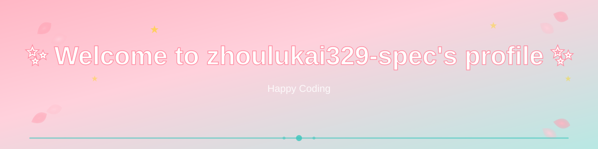

  

  <h1>Hi, I'm Zhou Lukai 👋</h1>
  

    Cybersecurity undergraduate at Xiamen University 
    Exploring AI agents, backend engineering, and AI algorithms
  

  

## About Me

- 🎓 Bachelor of Engineering student in Cybersecurity at Xiamen University
- 🤖 Interested in AI agents and intelligent application development
- 🛠️ Focused on backend engineering and reliable, maintainable systems
- 🌱 Continuously learning new technologies and turning ideas into working software

## Skills

### Languages

  
  
  
  

### Backend & API

  
  
  
  
  

### AI & Agent Engineering

  

### Databases

  
  

### Tools & Platforms

  
  
  
  

## Career Directions
- Backend Development
- Full-Stack Development
- AI Agent Development
- Security Development

  

